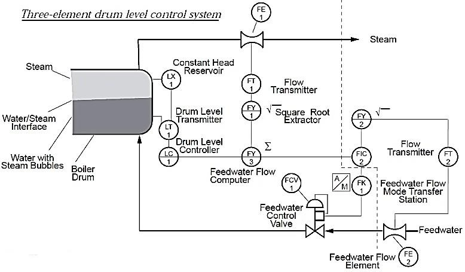
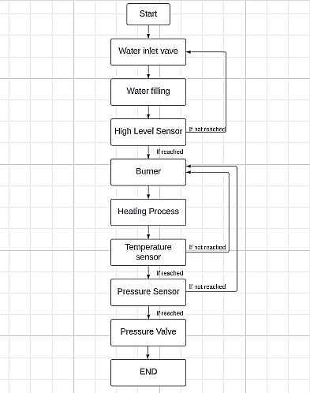
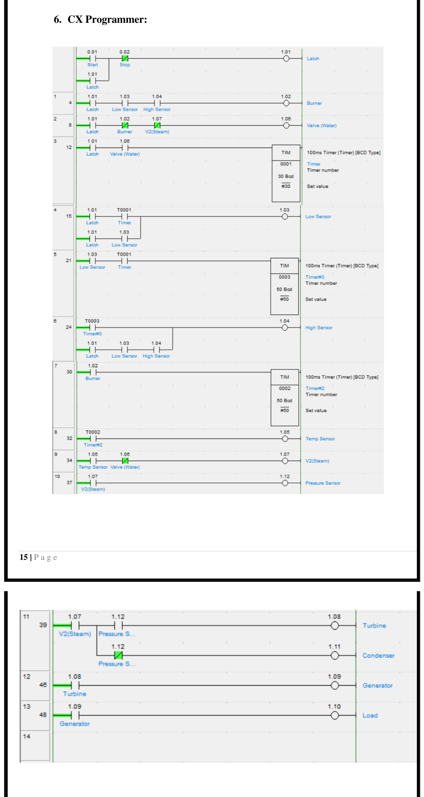
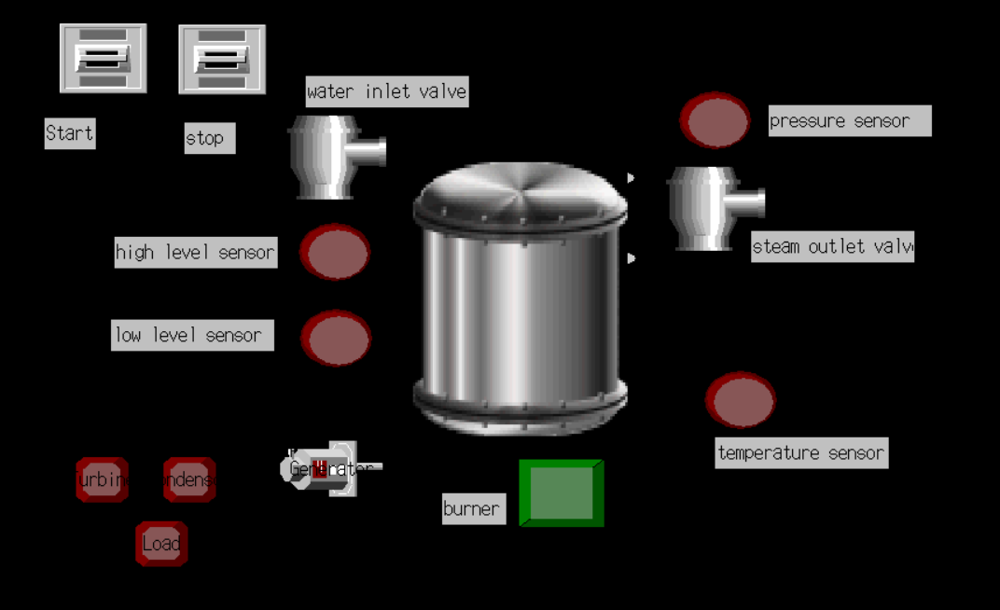
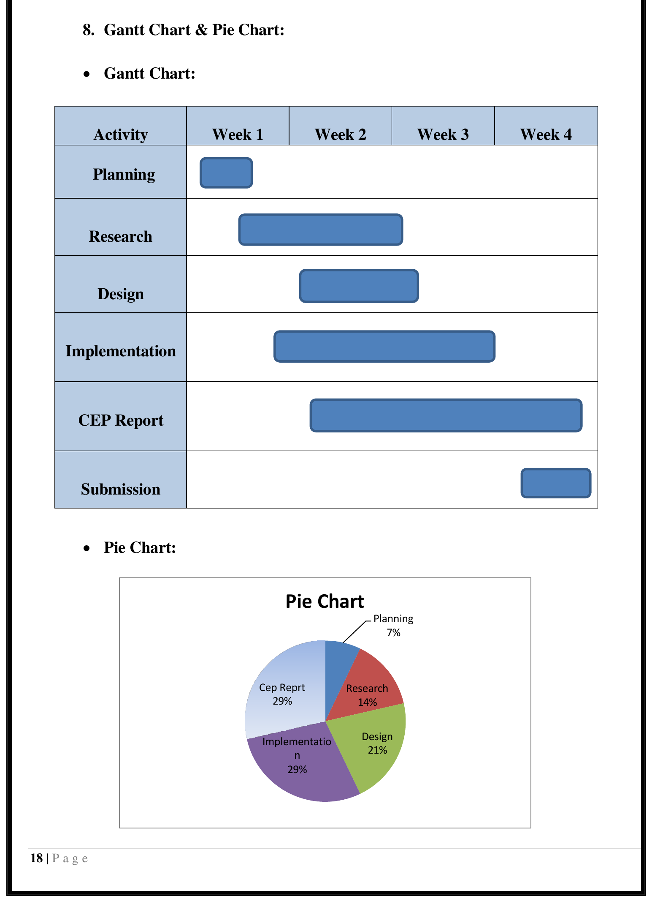

# Boiler Automation System — Steam Flow, Water Flow & Drum Level Control

A three-element drum level control system for an industrial boiler: steam flow, feedwater flow, and drum level are monitored and regulated together, implemented as PLC ladder logic with an HMI operator panel — designed as an Industrial Automation Complex Engineering Problem (CEP).

**Authors:** Muhammad Talha, Muhammad Umer Mujahid, Muhammad Hassan, Abdullah Khan, Hassan Raza, Ahmed Atif
**Course:** Industrial Automation — Complex Engineering Problem (CEP)
**Instructor:** Dr. Ahsan Ali · University of Engineering and Technology, Taxila · May 2024

## Objective

Design a boiler automation system that keeps steam flow, feedwater flow, and drum level within safe operating limits at the same time — preventing drum overflow or dry-running, optimizing fuel/air/water inputs, and building in the safety interlocks a real boiler needs — implemented as PLC ladder logic driving an HMI mimic panel.

## Control Strategy: Three-Element Drum Level Control

A simple two-element scheme (level + feedwater flow) holds up fine under steady loads, but boilers with fast or unpredictable steam demand need a third input — steam flow — so the controller can react to a demand change *before* it shows up as a level error. This project implements that three-element cascade:

- **Drum Level Transmitter (LT1)** — measures the water/steam interface level in the drum
- **Steam Flow Transmitter (FT1)** — measures steam leaving the drum
- **Feedwater Flow Transmitter (FT2)** — measures water entering the drum
- **Feedwater Flow Computer (FY3, a summing block)** — combines the level controller's output with the steam flow signal to produce a feedwater setpoint that anticipates demand changes, rather than just reacting to them

| Tag | Instrument | Role |
|---|---|---|
| FE1 / FT1 | Steam flow element / transmitter | Measures steam leaving the drum |
| LT1 / LX1 | Drum level transmitter | Measures the water/steam interface |
| LC1 | Drum level controller | Compares level to setpoint |
| FY3 (Σ) | Feedwater flow computer | Sums the level-controller output with steam flow (cascade) |
| FIC2 | Feedwater flow controller | Drives the feedwater control valve |
| FT2 / FE2 | Feedwater flow transmitter / element | Measures water entering the drum |
| FCV1 | Feedwater control valve | Final control element for water inlet |
| FK1 | Feedwater flow mode transfer station | Auto/manual control handoff |

## Process Flow

Water inlet valve opens → drum fills → **high-level sensor** confirms fill (loops back to filling if not yet reached) → burner ignites → heating proceeds → **temperature sensor** confirms target reached (loops back to the burner if not) → **pressure sensor** confirms target reached (loops back to the burner if not) → pressure/steam valve releases steam → cycle ends.

## Sensor Selection

Sensors were shortlisted and compared across local (Pakistani market) and international suppliers on range, accuracy, and price before final selection:

| Parameter | Selected sensor | Key spec | Indicative price |
|---|---|---|---|
| Pressure | MPS-33 (vacuum/compound/positive variants) | Range from -101 kPa to 1 MPa depending on variant | ₨2,500–3,500 |
| Level | Capacitive level sensor / boiler water level probe | 25–636 mm range; probe rated to 250°C | ₨2,000–45,000 |
| Temperature | K-type thermocouple | -50°C to 1300°C | ₨1,850–2,000 |

## PLC Implementation (CX-Programmer)

The control sequence is implemented as Omron ladder logic:

- **Start/Stop latch** — a Start contact sets a Latch bit that holds itself on until Stop is pressed.
- **Burner control** — the Burner output is interlocked with Low-Level and High-Level sensor bits so it can only run within the correct water-level window.
- **Water valve** — interlocked with the burner and the steam valve state, so feedwater and burner operation don't fight each other.
- **Timers standing in for sensor thresholds** — three 100 ms timers (set to 30 and 50 ticks, i.e. **3.0 s** and **5.0 s**) sequence the Low-Level, High-Level, and Temperature sensor bits, modeling the time it takes each condition to be reached.
- **Steam/pressure path** — once temperature is confirmed, the Steam valve opens; the Pressure Sensor bit then routes flow to either the **Turbine** (pressure reached) or the **Condenser** (pressure not yet reached).
- **Power train** — Turbine → Generator → Load, completing the steam-to-electricity chain.

## HMI (CX-Designer)

An operator mimic panel built in CX-Designer mirrors the same PLC bits used in the ladder logic: Start/Stop buttons, water inlet valve, high/low level sensors, burner, steam outlet valve, pressure and temperature indicators, and the turbine/condenser/generator/load chain — so an operator can see and control the process state in real time.

## Project Timeline

Delivered over a 4-week schedule: Planning (7%), Research (14%), Design (21%), Implementation (29%), and the CEP report (29%), with implementation and reporting overlapping in the later weeks.

## Outcomes

A well-implemented three-element control scheme reduces manual intervention and human error, gives real-time monitoring and alarm capability, and — for a real boiler — improves operating safety, extends equipment lifespan, and improves energy efficiency.

## Tools

Omron CX-Programmer (PLC ladder logic) · Omron CX-Designer (HMI design) · P&ID / process flow diagramming

## Repository Contents

- `Boiler Automation System.pdf` — full CEP report: literature review, control theory, sensor selection & comparison, P&ID, ladder logic, HMI design, and project planning.
- `boiler-pi-diagram.png` — three-element drum level control P&I diagram.
- `boiler-flow-chart.png` — process/control flow chart.
- `boiler-cx-programmer.png` — PLC ladder logic (CX-Programmer).
- `boiler-cx-designer-hmi.png` — HMI operator mimic panel (CX-Designer).
- `boiler-gantt-pie-chart.png` — project execution timeline.

## References

Sensor specifications and pricing were sourced from manufacturer/retailer listings including misumi-ec.com, comoso.com, directindustry.com, gemssensors.com, hallroadlahore.pk, and daraz.pk (see report for full citations).
